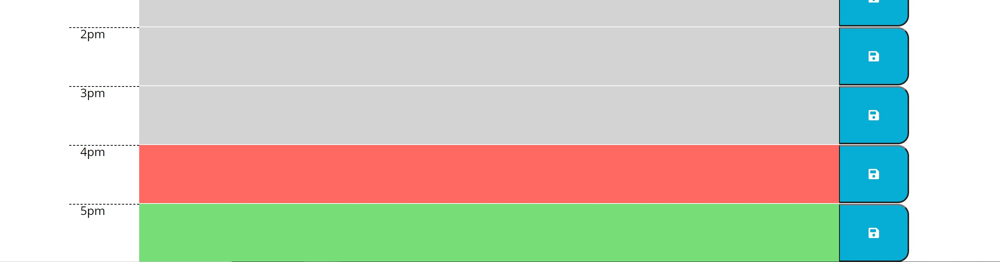

# w5-hw-assignment

## Motivation 
This product is a schedule that allows user to add tasks to it to help plan their day. It will also show you what hour of the day it is and highlight in red, grey or green if the task set is in the present, past or future respectivley. This showcases the storage usage of local storage as well as the utilisation of moment.js

## Installation
- set input fields to variables and added them to an array
- use moment.js to add current day and time
- add for loop through input array to check the time and add the correct class accordingly
- use for loop through inputs to check for content and add to local storage
- use for loop to render the items in the correct location on the display
- when a save button is clicked, the code is executed, their input saved to local storage so upon refresh of page, their input is still there.

## Usage

The above image showcases the change of colours when  a task is in the past, present or future. The time in this image is 4:34 so any task between 4-5 is highlighted red while tasks before are highlighted in grey and future tasks are green. 

## Credits
https://adelaide.bootcampcontent.com/the-university-of-adelaide/uadel-adel-fsf-pt-11-2020-u-c.git

## Licnece 
MIT License

Copyright (c) [2020] [Ben Cyna]

Permission is hereby granted, free of charge, to any person obtaining a copy
of this software and associated documentation files (the "Software"), to deal
in the Software without restriction, including without limitation the rights
to use, copy, modify, merge, publish, distribute, sublicense, and/or sell
copies of the Software, and to permit persons to whom the Software is
furnished to do so, subject to the following conditions:

The above copyright notice and this permission notice shall be included in all
copies or substantial portions of the Software.

THE SOFTWARE IS PROVIDED "AS IS", WITHOUT WARRANTY OF ANY KIND, EXPRESS OR
IMPLIED, INCLUDING BUT NOT LIMITED TO THE WARRANTIES OF MERCHANTABILITY,
FITNESS FOR A PARTICULAR PURPOSE AND NONINFRINGEMENT. IN NO EVENT SHALL THE
AUTHORS OR COPYRIGHT HOLDERS BE LIABLE FOR ANY CLAIM, DAMAGES OR OTHER
LIABILITY, WHETHER IN AN ACTION OF CONTRACT, TORT OR OTHERWISE, ARISING FROM,
OUT OF OR IN CONNECTION WITH THE SOFTWARE OR THE USE OR OTHER DEALINGS IN THE
SOFTWARE.

## working product 
https://bencyna.github.io/w5-hw-assignment/